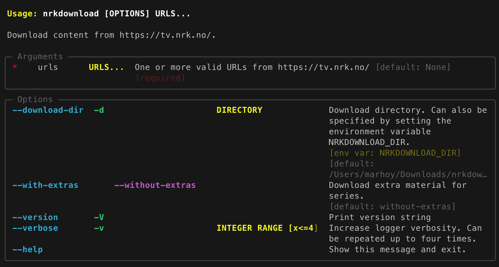

# Usage

Start by browsing <https://tv.nrk.no> until you find what you want. Copy the URL and
give it as an argument for this tool. You can list several URLs on the command line
(separated by space). Content that are already downloaded will be skipped.

## Arguments and Options

The files are by default downloaded to `~/Downloads/nrkdownload`. This can be changed by
using the option `-d` as described above, or you can define the environment variable
`NRKDOWNLOAD_DIR`.

## URL Parsing and actions

- If the URL points to the top-level of a series, all episodes in all seasons will be
  downloaded.

- If the URL points to a specific season, all episodes within that season will be
  downloaded.

- If the URL points to a specific episode, only that one episode will be downloaded.
